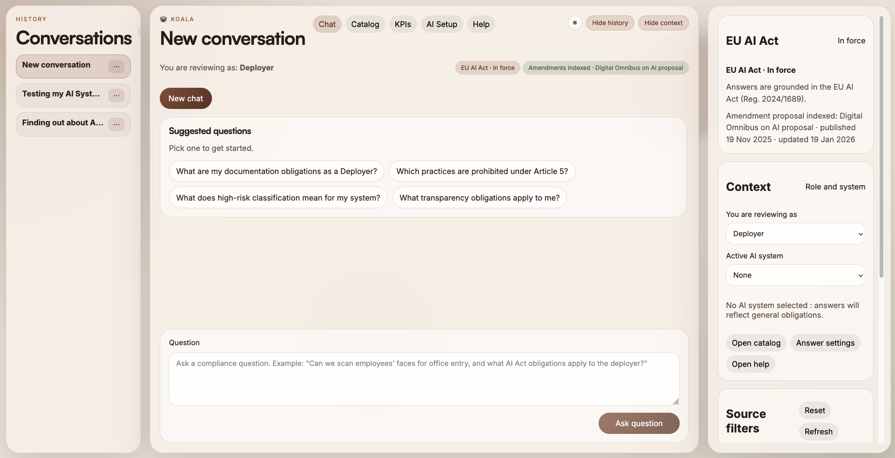

# 🐨 Koala : AI Act Governance Assistant

Koala is an open-source, self-hostable assistant for compliance teams who need defensible answers under the EU AI Act.
It starts with your AI system catalog and ends with citations you can paste into governance notes. The Digital Omnibus
proposal is treated as an amendment to the AI Act, not a separate regime.




## What it does today

- Supports ingesting AI Act sources into a searchable index (AI Act PDF included; Omnibus proposal must be supplied separately).
- Answers questions with citations and falls back to extractive responses when models are unavailable.
- Stores AI system entries and produces role-aware risk and obligation summaries.

## What is included

This is a practical stack, not a research prototype. The goal is explainable, citable answers:

- PDF parsing into recital, article, and annex chunks
- Language detection for `en`, `de`, `fr`, `it`, and `es`
- Local embeddings via `sentence-transformers`
- Persistent vector storage via ChromaDB
- Sparse BM25 index built from stored chunks
- Hybrid retriever (BM25 + dense + RRF + optional reranking + confidence scoring)
- Answer generation with LiteLLM and an extractive fallback
- FastAPI API with:
  - `POST /query`
  - `POST /ingest`
  - `GET /sources`
  - `GET /health`
  - `GET /config`
  - `DELETE /sources/{id}`
- SvelteKit frontend with chat, catalog, source filters, and citations
- Containerized deployment with separate backend and frontend images

## Quickstart

Recommended Python version: 3.12 (see `.python-version`).

```bash
python3 -m venv .venv
source .venv/bin/activate
pip install -r requirements.txt
```

Run the backend locally:

```bash
uvicorn api.main:app --reload
```

Run the frontend locally (the full app is served at `/app`, the landing page lives at `/`, and the demo is `/demo`):

```bash
cd frontend
npm install
npm run dev
```

Ingest the AI Act through the CLI:

```bash
python -m ingestion.pipeline ingest --pdf ./data/pdfs/OJ_L_202401689_EN_TXT.pdf --source "AI Act (EU 2024/1689)"
```

Ingest the Digital Omnibus on AI proposal:

Download the proposal PDF and place it at `./data/pdfs/CELEX_52025PC0836_EN_TXT.pdf` (not bundled in the repo).

```bash
python -m ingestion.pipeline ingest --pdf ./data/pdfs/CELEX_52025PC0836_EN_TXT.pdf --source "Digital Omnibus on AI (COM(2025) 836)"
```

Or ingest through the API:

```bash
curl -X POST http://localhost:8000/ingest \
  -H "Content-Type: application/json" \
  -d '{"pdf_path":"./data/pdfs/OJ_L_202401689_EN_TXT.pdf","source":"AI Act (EU 2024/1689)"}'
```

```bash
curl -X POST http://localhost:8000/ingest \
  -H "Content-Type: application/json" \
  -d '{"pdf_path":"./data/pdfs/CELEX_52025PC0836_EN_TXT.pdf","source":"Digital Omnibus on AI (COM(2025) 836)"}'
```

Note: source filters and badges match source labels. Keep labels recognizable (e.g., “AI Act (EU 2024/1689)” and
“Digital Omnibus on AI (COM(2025) 836)”) so the UI can surface them consistently.

Query the API:

```bash
curl -X POST http://localhost:8000/query \
  -H "Content-Type: application/json" \
  -d '{"question":"What are the transparency obligations for high-risk AI systems?"}'
```

Run the full stack with Docker (visit `http://localhost:3000/app` for the full app UI):

```bash
cp .env.example .env
docker compose up --build
```

## Demo mode (serverless-friendly)

The public demo at `/demo` is scripted and does not call the backend. If you want to host the full UI on a serverless platform, enable **demo mode**:

- Catalog entries are stored in the browser only (cleared when site data is removed).
- Local assistants (Ollama) are disabled; hosted providers require your API key.
- Retrieval runs in **lightweight mode (BM25 only)** when dense dependencies are not installed, to keep serverless bundles small.

To enable demo mode in a deployment, set:

```bash
PUBLIC_DEMO_MODE=1
```

If you deploy the backend to a serverless platform (e.g., Vercel), use a writable
directory for Chroma and seed it from the bundled index:

```bash
CHROMA_PERSIST_DIRECTORY=/tmp/chroma
KOALA_CHROMA_SEED_DIR=data/chroma
```

For the **full local deployment** with semantic retrieval and reranking, install the full dependency set:

```bash
pip install .[full]
```

Or keep using the existing full dependency file:

```bash
pip install -r requirements.txt
```

## Project layout

```text
ingestion/           PDF parsing, language detection, chunk models, ChromaDB wrapper, CLI
retrieval/           BM25 index, hybrid retriever, HyPE helpers
generation/          LiteLLM wrapper, prompts, retrieval-to-answer chain
api/                 FastAPI app, settings, schemas, routes
frontend/            SvelteKit chat client
data/                ChromaDB persistence and local PDFs
Dockerfile.backend   Python API image
Dockerfile.frontend  SvelteKit image
docker-compose.yml   Two-service local deployment
```

## Notes

- The parser is intentionally simple and article-oriented to preserve legal meaning.
- Dense retrieval and reranking degrade gracefully when optional model dependencies are unavailable.
- Answer generation degrades to an extractive fallback when LiteLLM is not installed or no provider is reachable.
- Koala supports compliance analysis but does not provide legal advice.
- Local Ollama runs at `http://localhost:11434` by default.
- Docker overrides Ollama to `http://host.docker.internal:11434` via compose.
